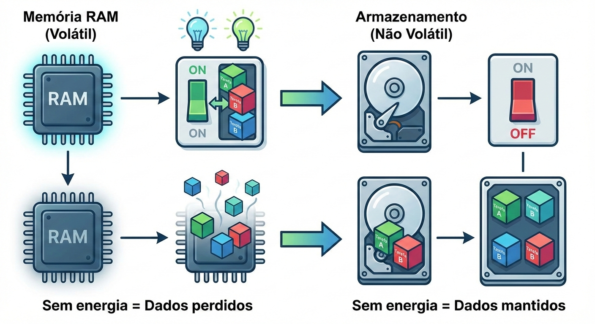
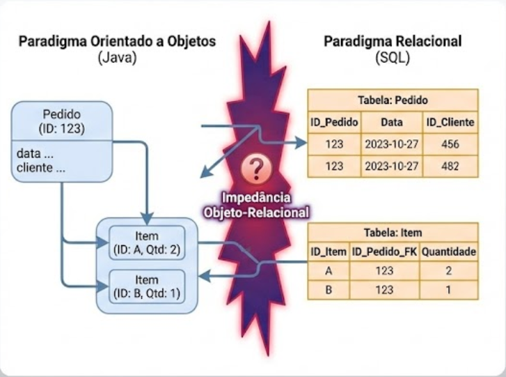
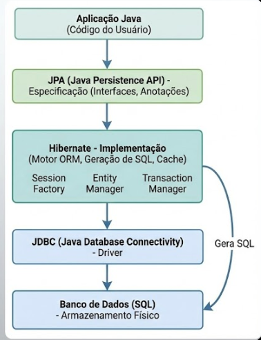

# Capítulo 2: Persistência de Dados e a Abstração Relacional

## Tópicos deste Capítulo
1. [Introdução Conceitual: Volatilidade](#1-introdução-conceitual-a-volatilidade-e-o-estado)
2. [O Problema da Incompatibilidade (Impedance Mismatch)](#2-o-problema-da-incompatibilidade-impedance-mismatch)
3. [A Solução ORM e o Ecossistema JPA](#3-a-solução-orm-e-o-ecossistema-jpa)
4. [Modelagem da Entidade](#4-modelagem-da-entidade-the-entity-model)
5. [O Padrão Repository e Spring Data](#5-o-padrão-repository-e-spring-data)
6. [Integração: Refatorando o Controller](#6-integração-refatorando-o-controller)
7. [Análise do Fluxo Completo](#7-análise-do-fluxo-completo-de-persistência)
8. [Conclusão](#8-conclusão)

---

### Objetivos do Capítulo
* Compreender o problema da volatilidade da memória e a necessidade de persistência.
* Analisar o **Dilema da Impedância Objeto-Relacional** (*Object-Relational Impedance Mismatch*).
* Definir formalmente o conceito de **ORM** (*Object-Relational Mapping*).
* Distinguir as responsabilidades entre **JPA** (Especificação), **Hibernate** (Implementação) e **Spring Data** (Abstração).
* Implementar a camada de modelo e repositório conectada a um banco de dados.

---

## 1. Introdução Conceitual: A Volatilidade e o Estado

No capítulo anterior, construímos uma API capaz de receber e responder requisições. Contudo, nossa implementação possuía uma falha crítica de design para um sistema de produção: o armazenamento dos dados dependia de uma estrutura em memória (`java.util.List`).

A memória principal (RAM) de um servidor é, por definição, **volátil**. Isso significa que, ao reiniciarmos a aplicação — seja por uma falha, uma atualização ou um desligamento programado — todo o estado acumulado (as tarefas criadas) é perdido irreversivelmente.




Para que um sistema tenha utilidade real, ele deve garantir a durabilidade dos dados. Isso nos obriga a transferir o estado da memória volátil para um meio de armazenamento não-volátil, tipicamente um **Banco de Dados**.

---

## 2. O Problema da Incompatibilidade (Impedance Mismatch)

Antes de escrevermos código, devemos enfrentar um problema teórico fundamental na Ciência da Computação: a dissonância entre dois paradigmas dominantes.

* **O Paradigma Orientado a Objetos (Java):** Organiza dados em grafos de objetos interconectados, com herança, polimorfismo e encapsulamento.
* **O Paradigma Relacional (SQL):** Organiza dados em tabelas bidimensionais (linhas e colunas), regidas pela álgebra relacional e chaves estrangeiras.

Suponha um objeto `Pedido` que contém uma lista de objetos `Item`. Em Java, isso é uma referência de memória. No banco de dados, isso não existe; existem duas tabelas (`tb_pedido` e `tb_item`) ligadas por um ID numérico.




> **Definição 2.1 (Impedância Objeto-Relacional):** É o conjunto de dificuldades técnicas e conceituais encontradas ao tentar mapear objetos de um sistema orientado a objetos para tabelas de um banco de dados relacional.

Tentar fazer essa tradução manualmente (escrevendo SQL puro dentro do Java e populando objetos à mão) é trabalhoso, repetitivo e propenso a erros. Surge, então, a necessidade de uma camada intermediária que automatize essa tradução.

---

## 3. A Solução ORM e o Ecossistema JPA

Para resolver a impedância, utilizamos a técnica de **ORM** (*Object-Relational Mapping*). Uma ferramenta ORM atua como um tradutor simultâneo: ela observa seus objetos Java e gera o SQL necessário automaticamente.

No ecossistema Java, é vital distinguir três camadas que frequentemente confundem iniciantes:




1.  **JPA (Java Persistence API):** É uma **Especificação**. É um documento (uma interface gigante) que define como o mapeamento deve funcionar. O JPA não é código executável por si só; é um conjunto de regras e anotações (como `@Entity`).
2.  **Hibernate:** É uma **Implementação**. É a biblioteca que realmente lê as regras do JPA e faz o trabalho pesado de gerar SQL e conectar ao banco. Ele é o "motor" por baixo do capô.
3.  **Spring Data JPA:** É uma **Abstração de Alto Nível**. Ele simplifica o uso do Hibernate/JPA, eliminando a necessidade de escrever código repetitivo para operações básicas (Salvar, Buscar, Deletar).

*Neste capítulo, utilizaremos a pilha completa: Spring Data JPA usando Hibernate para implementar a especificação JPA.*

---

## 4. Modelagem da Entidade (The Entity Model)

Vamos redefinir nosso conceito de "Tarefa". Em vez de uma simples String, agora teremos uma classe estruturada que representa uma tabela no banco de dados. No JPA, chamamos essa classe de **Entidade**.

### 4.1 Mapeamento via Anotações
As anotações servem como metadados. Elas dizem ao framework ORM como interpretar a classe Java.

```java
package com.exemplo.api.model;

import jakarta.persistence.*;
import java.time.LocalDateTime;

// 1. @Entity: A anotação fundamental. Diz ao JPA: "Esta classe representa uma tabela no banco".
@Entity
// 2. @Table: Opcional. Permite definir o nome exato da tabela. Se omitido, usa o nome da classe.
@Table(name = "tb_tarefas")
public class Tarefa {

    // 3. @Id: Indica qual atributo será a Chave Primária (Primary Key) da tabela.
    @Id
    // 4. @GeneratedValue: Define como o ID é gerado. IDENTITY delega ao banco (auto-incremento).
    @GeneratedValue(strategy = GenerationType.IDENTITY)
    private Long id;

    // 5. @Column: Permite configurar detalhes da coluna (nome, tamanho, obrigatoriedade).
    @Column(nullable = false, length = 100)
    private String descricao;

    private boolean concluida;

    @Column(name = "data_criacao")
    private LocalDateTime dataCriacao = LocalDateTime.now();

    // O JPA exige um construtor vazio (padrão) para instanciar a classe via reflexão.
    public Tarefa() {}

    // Construtor utilitário para nós
    public Tarefa(String descricao) {
        this.descricao = descricao;
        this.concluida = false;
    }

    // Getters e Setters (Essenciais para o encapsulamento e acesso do framework)
    public Long getId() { return id; }
    public String getDescricao() { return descricao; }
    public void setDescricao(String descricao) { this.descricao = descricao; }
    public boolean isConcluida() { return concluida; }
    public void setConcluida(boolean concluida) { this.concluida = concluida; }
}

```

Ao iniciar a aplicação, o Hibernate lerá esta classe e executará um comando SQL equivalente a:
`CREATE TABLE tb_tarefas (id BIGINT AUTO_INCREMENT, descricao VARCHAR(100)...);`

---

## 5. O Padrão Repository e Spring Data

Agora que temos a tabela mapeada, precisamos de um mecanismo para acessá-la. No passado (padrão DAO tradicional), teríamos que escrever uma classe com métodos manuais de conexão. O Spring Data introduz o conceito de **Repositórios Declarativos**.

> **Conceito Chave:** Em vez de implementar a lógica de acesso a dados, nós apenas definimos uma interface e o Spring gera a implementação em tempo de execução (*Runtime*).

### 5.1 A Interface Repository

```java
package com.exemplo.api.repository;

import com.exemplo.api.model.Tarefa;
import org.springframework.data.jpa.repository.JpaRepository;
import org.springframework.stereotype.Repository;

// Estendemos JpaRepository<TipoDaEntidade, TipoDoId>
@Repository
public interface TarefaRepository extends JpaRepository<Tarefa, Long> {
    // Neste momento, esta interface está vazia.
    // MAS, por herdar de JpaRepository, ela já ganhou magicamente métodos como:
    // .save(Tarefa t)
    // .findAll()
    // .findById(Long id)
    // .delete(Tarefa t)
}

```

Isso é uma demonstração poderosa da metaprogramação do Spring. Não escrevemos uma única linha de SQL, mas temos um componente completo de acesso a dados (CRUD).

---

## 6. Integração: Refatorando o Controller

Agora, substituiremos nossa lista em memória pelo `TarefaRepository`. Aqui, aplicamos a **Injeção de Dependência** vista no Capítulo 1. O Controller não cria o repositório; ele o pede ao Spring.

```java
package com.exemplo.api.controller;

import com.exemplo.api.model.Tarefa;
import com.exemplo.api.repository.TarefaRepository;
import org.springframework.web.bind.annotation.*;
import java.util.List;

@RestController
@RequestMapping("/api/tarefas")
public class TarefaController {

    private final TarefaRepository repositorio;

    // Injeção de Dependência via Construtor (Prática recomendada)
    public TarefaController(TarefaRepository repositorio) {
        this.repositorio = repositorio;
    }

    @GetMapping
    public List<Tarefa> listar() {
        // O método findAll() executa um "SELECT * FROM tb_tarefas"
        return repositorio.findAll();
    }

    @PostMapping
    public Tarefa criar(@RequestBody Tarefa novaTarefa) {
        // O método save() executa um "INSERT INTO..." e retorna o objeto com o ID gerado
        return repositorio.save(novaTarefa);
    }
    
    // Um novo endpoint para buscar por ID
    @GetMapping("/{id}")
    public Tarefa buscarPorId(@PathVariable Long id) {
        // findById retorna um Optional. .orElse(null) é simplificação didática;
        // em produção, retornaríamos um erro 404 se não encontrado.
        return repositorio.findById(id).orElse(null);
    }
}

```

### 6.1 Configuração do Banco de Dados

Para que tudo isso funcione, o Spring precisa saber onde está o banco de dados. Em um arquivo chamado `application.properties`, definimos as credenciais. Para fins de aprendizado, usaremos o **H2 Database**, um banco em memória.

```properties
# application.properties

# Configura o driver do banco H2
spring.datasource.url=jdbc:h2:mem:testdb
spring.datasource.driverClassName=org.h2.Driver
spring.datasource.username=sa
spring.datasource.password=

# Habilita o console do H2 para visualizarmos a tabela no navegador
spring.h2.console.enabled=true

# Instrui o Hibernate a criar as tabelas baseadas nas classes @Entity
spring.jpa.hibernate.ddl-auto=update

```

---

## 7. Análise do Fluxo Completo de Persistência

Vamos rastrear uma requisição POST com o novo fluxo:

1. **Cliente:** Envia `POST /api/tarefas` com JSON `{ "descricao": "Aprender JPA" }`.
2. **Spring Web:** Recebe o JSON e o converte para um objeto `Tarefa` (ID é nulo neste momento).
3. **Controller:** Chama `repositorio.save(tarefa)`.
4. **Spring Data Proxy:** Intercepta a chamada.
5. **Hibernate:**
* Analisa o objeto.
* Abre uma transação com o banco.
* Gera o SQL: `INSERT INTO tb_tarefas (descricao, concluida, data_criacao) VALUES (...);`


6. **Banco de Dados:** Persiste a linha e gera o ID (ex: 1).
7. **Hibernate:** Atualiza o objeto Java com o ID gerado.
8. **Retorno:** O objeto (agora com ID 1) volta ao Controller, é convertido para JSON e retornado ao cliente.

---

## 8. Conclusão

Neste capítulo, superamos a limitação da memória volátil. Atravessamos a ponte teórica da Impedância Objeto-Relacional e utilizamos o JPA e o Spring Data para mapear classes Java diretamente para tabelas de banco de dados.

Agora, nossa aplicação não apenas processa informações, ela as lembra. O uso de interfaces de repositório (`extends JpaRepository`) demonstra como o framework abstrai a complexidade do SQL, permitindo que o foco permaneça na modelagem do domínio.

> **Nota de Atenção:** Introduzimos uma vulnerabilidade sutil: estamos expondo nossa entidade de banco de dados (`Tarefa`) diretamente na API (no Controller). Se mudarmos o banco de dados, quebraremos a API pública.

No próximo capítulo, abordaremos como resolver isso utilizando o padrão **DTO** (*Data Transfer Object*) e adicionaremos a **Camada de Serviço** (*Service Layer*) para abrigar as regras de negócio reais.
